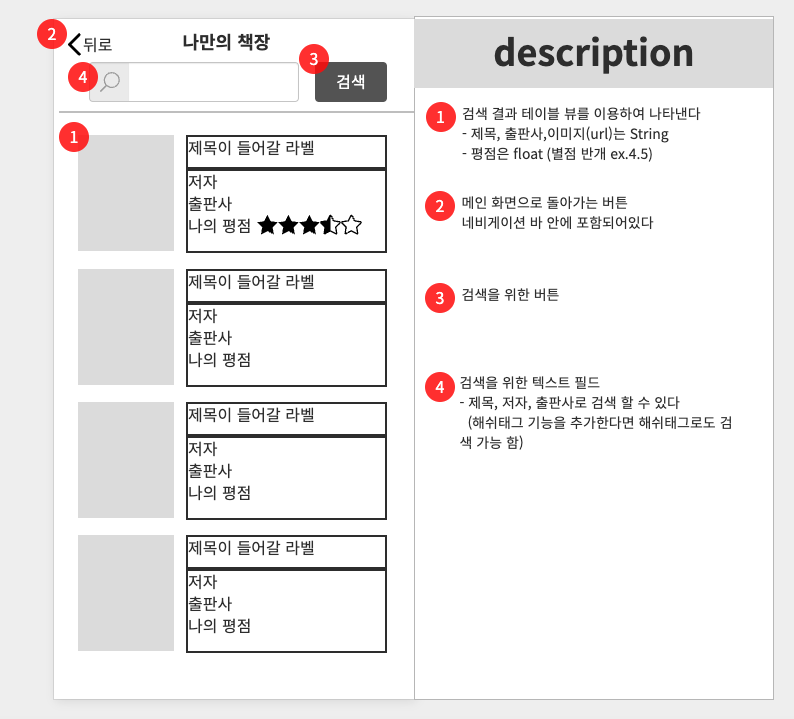
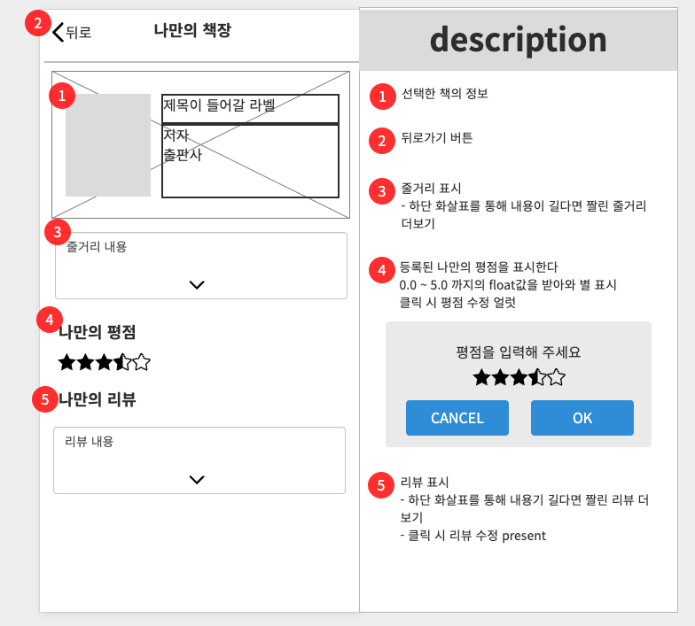
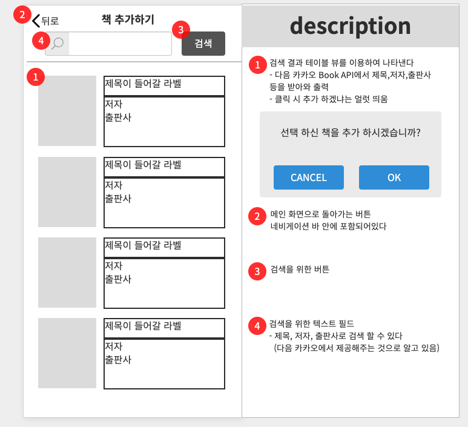
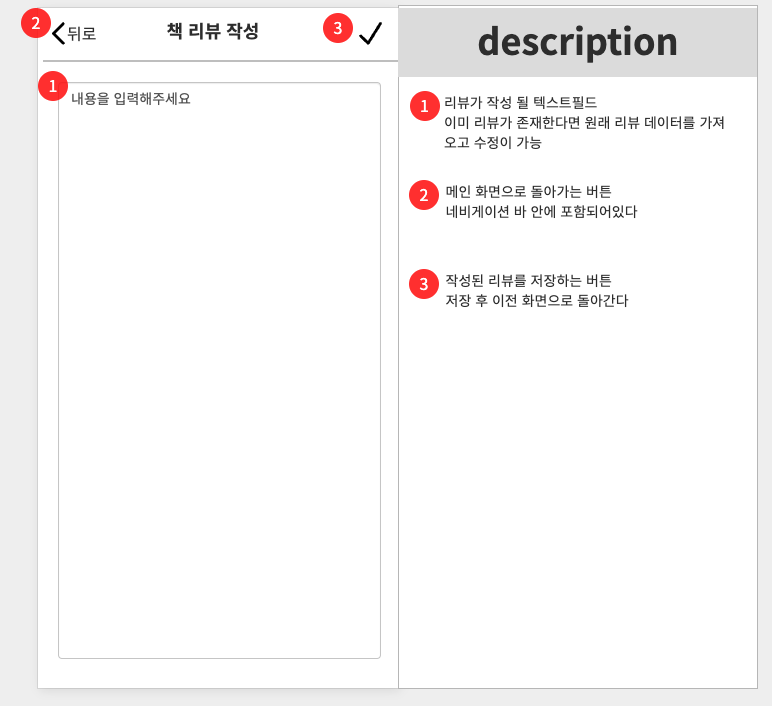
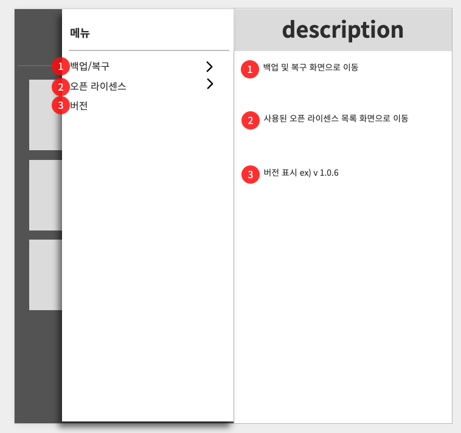
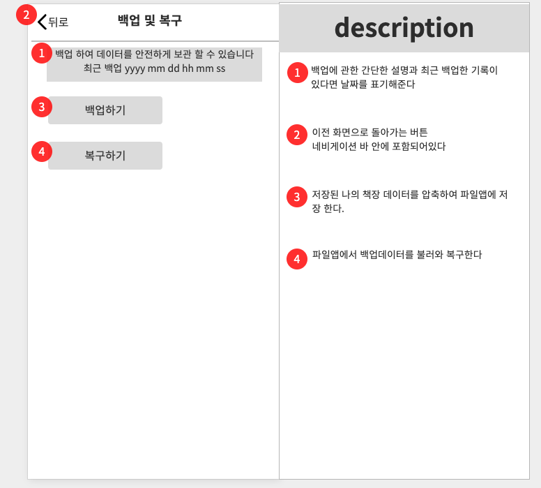
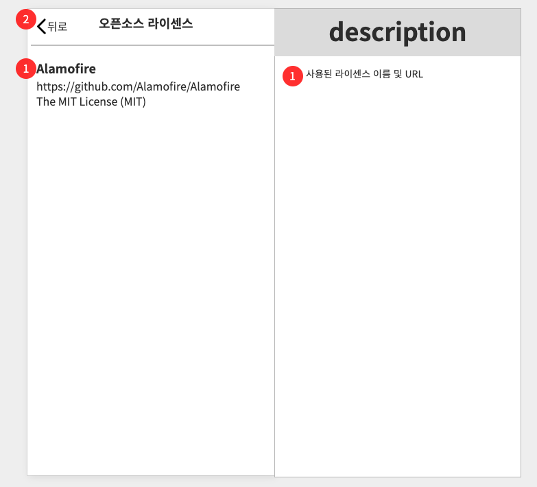

# SeSSAC 개인 프로젝트 기획서

### 목차
- 개요
  - [목적](#1-목적)
  - [일정](#2-일정)
  - [예상시간](#3-예상시간)
  - [기술 스택](#4-기술-스택)
- 화면 구성
  - [메인](#1-메인)
  - [나만의 책 검색](#2-나만의-책-검색)
  - [책 상세보기](#3-책-상세보기)
  - [신규 책 검색 및 추가](#4-신규-책-검색-및-추가)
  - [리뷰 입력 및 수정](#5-리뷰-입력-및-수정)
  - [사이드 메뉴](#6-사이드-메뉴)
  - [백업 복구](#7-백업-복구)
  - [오픈소스 라이센스](#8-오픈소스-라이센스)

-------------------------
## 개요

### 1. 목적

사람들은 자신이 가지고 있거나, 읽었던 책을 정리하는 경우가 흔치 않다.

이 앱을 통해 책들을 나만의 평점과 리뷰와 함께 책장 처럼 정리 하여

기억에 남는 책의 리뷰를 돌아보거나, 평점을 통해 취향을 알아 볼 수 있다.

또한 책 컬렉션이 쌓이는 것을 직접 눈으로 보며 수집욕이 있는 사용자로 하여금 만족감을 줄 수 있을 것으로 기대한다.

### 2. 일정

| 기간 | 개발항목 |
|-------|:--------:|
| 11/15~11/17 | 프로젝트 기획 |
| 11/18~11/20 | view 구성 및 화면전환 |
| 11/21~11/23 | API 호출, realm query 구현 |
| 11/24~11/26 | CRUD, 백업/복구 |
| 11/27~11/28 | QA, bugFix |
| 11/29 | release |

### 3. 예상시간

#### view 구성 및 화면전환

| 개발항목 | 예상시간 | 소요시간 | 비고 |
|---------|:----:|:----:|:----------|
| 예제 코드 검색 | 2h | 2h | .. |
| view 구성 | 8h | 13h | 라이브러리 연동,테스트 까지 포함하여 시간초과 |
| background,font asset 디자인 | 2h | 1h | 디자인은 마지막에 다시 수정 할 예정 |
| 화면전환 | 4h | 4h | .. |

#### API 호출, realm query 구현

| 개발항목 | 예상시간 | 소요시간 | 비고 |
|---------|:----:|:----:|:----------|
| API 문서 확인 및 테스트 | 2h | 2h | .. |
| API 호출 | 4h | 5h | kingfisher 사용이 필요하여 시간초과 |
| DB 스키마 | 4h | 2h | 테이블이 1개 뿐이라 얼마 안걸림 |
| realm query | 4h | 5h | 이미지 캐싱 구현에서 시간초과 |
| tableView,collectionView 테스트 | 2h | 2h | .. |

#### CRUD, 백업/복구

| 개발항목 | 예상시간 | 소요시간 | 비고 |
|---------|:----:|:----:|:----------|
| CRUD | 12h | 15h | 컬렉션뷰 이동을 구현하려다 보류 |
| 백업 복구 | 4h | 4h | .. |

#### QA, bugFix

| 개발항목 | 예상시간 | 소요시간 | 비고 |
|---------|:----:|:----:|:----------
| QA | 4h | 4h | .. |
| bugFix | 4h | 4h | .. |

### 4. 기술 스택

- UIKit
- StoryBoard
- Alomofire
  - https://github.com/Alamofire/Alamofire
- IQKeyboardManager
  - https://github.com/hackiftekhar/IQKeyboardManager
- SideMenu
  - https://github.com/jonkykong/SideMenu
- realm
  - 
- 카카오 Book API
  - https://developers.kakao.com/docs/latest/ko/daum-search

-------------------------

## 화면 구성

### 1. 메인

### 2. 나만의 책 검색

### 3. 책 상세보기

### 4. 신규 책 검색 및 추가

### 5. 리뷰 입력 및 수정

### 6. 사이드 메뉴

### 7. 백업 복구

### 8. 오픈소스 라이센스

